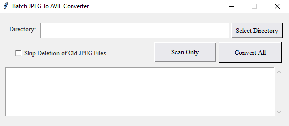

# Batch JPEG To Avif Converter

This project allows you to pick a directory and recursively scan for JPEG files that will be automatically converted to the newer, highly compressed [AVIF format](https://en.wikipedia.org/wiki/AVIF), shrinking 50-80% of the file size, in a large batch operation. 

The project provides a GUI interface that allows you to specify the folder as well as some options, such as whether or not the original files should be deleted, as well as a 'test' to only scan the directory and show the files that would have been found. 

# Downloads and Binaries

## Windows

There's an .exe file under the [/dist/Windows folder](/dist/Windows), this is a portable .exe file that does not require any separate setup or installation; all dependencies are included.

## Linux 

There's an executable file under the [/dist/Linux folder](/dist/Linux/), this can be run on a linux machine and also should not require any dependencies to be installed (Python and associated libraries will be bundled with the executable).

## Python Script

If you have trouble with either of the above, [you can reference the python script in the main directory here,](/GUI_Converting_JPEG_To_AVIF.py), which, as long as you have the following dependencies installed alongside Python, should run on any system: 
- pillow
- pillow-avif-plugin

## Context-Menu-Item Setup

Here are steps to register a context menu item version of this script, which allows you to just select any folder in the Windows file explorer and click to convert JPEGs in that folder to AVIF's. This is the most convenient option for frequent use. 

* Modify the 'install context menu item.bat' file, and replace any user / python installation directories mentioned in the file with your own.
* Right click the 'install context menu item.bat' file and select 'Run as Administrator'. This will add the right-click-menu / context menu item for this script. 

* Install Python if you don't already have it installed. 

* Install the 'pillow' and ' pillow-avif-plugin ' packages 
* ( i.e ' pip install pillow-avif-plugin ' in a python manager window such as python's native pip, or Anaconda3).

That's it! Run the script!

### Important Notes 

* The context menu item WILL reference the location of the python script in this folder (And as such it references the current directory that the .bat file runs from ). This means that later deleting or moving the python file will break the context menu item. 

